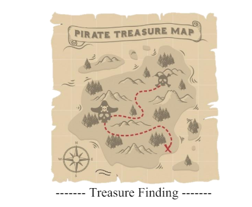

## Projet d'algorithme de recherche operationnel selon l'algorithme A*

### Ce projet implémente l'algorithme de recherche opérationnel A star pour ici retrouver le véritable trésor parmi de faux trésor avec une [carte prédéterminée](https://github.com/OumarEsiea/Projet-Algoritmie/blob/master/Carte%20-%20Matrice.pdf), on peut par contre décider des coordonnées des faux trésors et du vrai trésor :
Vous pouvez trouver ci-joints la documentation qui étaille plus en précision le projet ainsi que les configuration pour pouvoir lancer le projet
[DOCUMENTATION.docx](https://github.com/OumarEsiea/Projet-Algoritmie/blob/master/DOCUMENTATION.docx)
